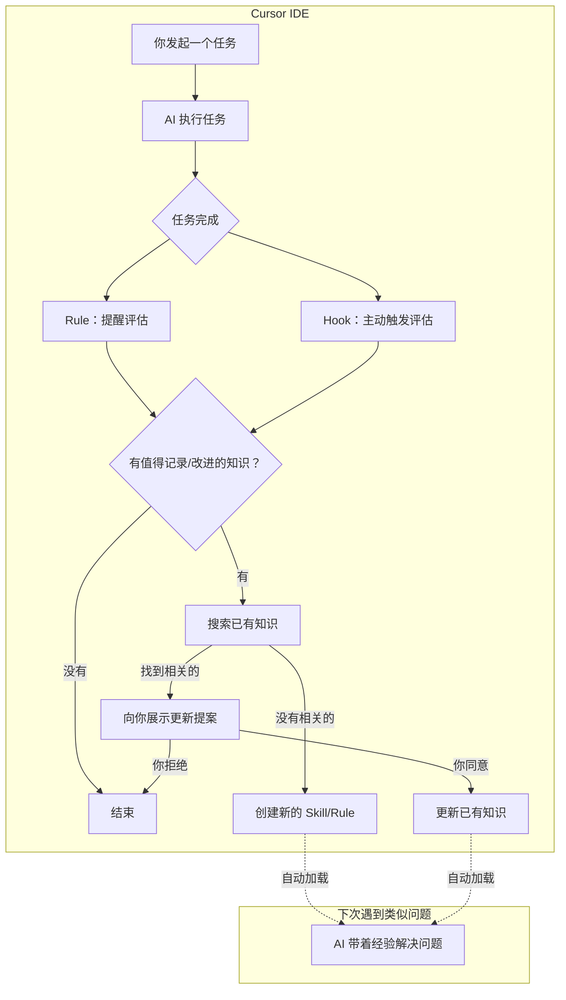

# Cursoreception：让 Cursor 学会「记住」和「自我改进」

> 装上这个插件，你的 AI 编程助手就会在每次工作后自动积累经验，并随着使用不断变得更聪明。

---

## 一句话版本

Cursoreception 让 Cursor 的 AI agent 自动把工作中发现的非显而易见的知识提取出来，存成可复用的文件。下次遇到类似问题，AI 会自动加载这些知识，不再从零开始。更重要的是——如果之前存的知识有了更好的理解，它会主动提议改进，而不是创建一堆重复的记录。

---

## 它解决什么问题？

你有没有遇到过这种情况：

花了半小时和 Cursor 一起排查一个奇怪的 bug，最终发现是某个配置项要特殊处理。过了一周，在另一个项目遇到同样的问题——Cursor 又从头开始猜。你得重新描述症状，重新走一遍排查流程，重新到达同一个答案。

**AI 不记事。** 每次对话都是全新的开始。你和它一起积累的经验，全部留在聊天记录里，不会变成下次能直接用的东西。

更让人头疼的是，当你用了一段时间，积累了一些知识之后，你会发现有些早期的记录已经过时了，但 AI 还在按旧的来。它只会不断往里加新的，从来不会回头改进已有的。

Cursoreception 解决这两个问题：**让 AI 记住有价值的东西，并且持续改进这些记忆。**

---

## 安装

**方式一：Cursor 插件市场**

打开 Cursor，在 Marketplace 搜索 `cursoreception`，点击安装。完事。

**方式二：手动安装**

```bash
git clone https://github.com/AnCoSONG/cursoreception && cd cursoreception
./install.sh --user          # 全局生效
./install.sh --project ~/app # 只在某个项目里生效
```

安装后重启 Cursor。不需要任何配置。

---

## 怎么用？

**什么都不用做。** 装完就忘掉它。

它在后台默默工作。每次你让 Cursor 完成一个任务，它会在最后多想一步：

> 「刚才那个过程里，有什么值得记下来的吗？」

如果有——比如你们一起排查了一个 bug，发现了文档没写的配置方式，或者踩了一个不明显的坑——它会自动把这些知识提取出来，存成 Cursor 能理解的格式。

下次你（或你的同事，或你换了个项目）遇到类似的情况，Cursor 会自动加载这些知识，像一个有经验的同事一样提供建议。

**如果你想主动触发：**

```
/cursoreception
```

或者直接说：

```
把刚才学到的保存成 skill
这次调试有什么值得记录的？
```

---

## 关键特性：知识会进化

这是 Cursoreception 最重要的设计理念：**知识不是一次性写入的死文件，而是会随着你的使用不断改进的活资产。**

举个例子：

1. 第一周，你排查了一个 Prisma 连接池的问题，Cursoreception 记录了「在 serverless 环境下，`connection_limit` 要设为 1」
2. 第三周，你发现这个方案在某些边缘情况下不够好，需要额外加一个 `pool_timeout` 配置
3. Cursoreception 不会再创建一条新记录。它会发现已有的 Prisma skill 和这次发现相关，然后：
   - 告诉你它打算怎么改：「我发现已有的 Prisma 连接池 skill 需要补充 pool_timeout 的配置，这是具体的修改内容……」
   - **等你确认**之后才改

这意味着你的知识库不会越用越臃肿——同一个主题的知识会越来越完善，而不是散落在多个重复的文件里。

### 更新确认

当 Cursoreception 决定更新一条已有的知识时，它不会悄悄改掉。它会通过一个选择题的形式问你：

- **同意** — 应用这次更新
- **拒绝** — 跳过，不做任何修改
- **修改** — 你觉得提议的方向对但细节需要调整

不管是项目级的知识还是全局的知识，更新前都会征求你的意见。对于全局级别的知识（影响你所有项目的那种），它会特别谨慎。

---

## 知识存在哪里？

| 类型 | 位置 | 适合什么 |
|---|---|---|
| **Skill** | `.cursor/skills/<名字>/SKILL.md` | 复杂知识：调试流程、API 集成方法、报错→根因映射 |
| **Rule** | `.cursor/rules/<名字>.mdc` | 简单规则：编码规范、文件类型约定、架构决策 |
| **AGENTS.md** | 项目根目录 | 轻量偏好：「用中文回复」「项目用 pnpm」 |

Skill 通过语义匹配加载——AI 理解你当前在做什么，自动找到相关的 Skill。Rule 通过文件路径匹配或全局生效。AGENTS.md 每次会话自动加载。

你也可以把 Skill 存到全局位置 `~/.cursor/skills/`，这样跨项目都能用。

---

## 用了之后会怎样？

**第一周**

目录里开始出现 `.cursor/skills/` 和 `.cursor/rules/`。每个文件对应一次有价值的发现。你可以打开看看——它们就是 Markdown 文件，写着问题是什么、怎么触发的、怎么解决的。

**几周之后**

你会注意到一些变化：
- 以前要排查半小时的问题，AI 一上来就给出了正确方向
- 新启动一个类似技术栈的项目，很多坑不用再踩了
- 有些早期的 skill 被更新过了——多了新的边缘情况、更好的解决方案

**理想状态**

你的 `.cursor/skills/` 目录变成了一个项目级的知识库。它不是你手写的文档，而是你和 AI 在实际工作中一起积累和打磨的经验。新同事来了，AI 自动就能用上这些经验。

---

## 什么情况下它不太有用？

- **改改文案、写写文档**：这类工作不太产生「非显而易见」的知识
- **完全标准化的流程**：如果一切都按文档做，不需要探索和试错，就没什么值得提取的
- **前几天**：需要一点时间积累，知识库建立起来之后效果才明显

---

## 它是怎么工作的？

如果你好奇内部机制，这里是简要说明。不想看可以跳过——不影响使用。

### 三个组件

**Rule — 随时提醒**

一条 `alwaysApply: true` 的规则，让 AI 在完成每个任务后自问：这次有没有值得记录或改进的？它用一组 checklist 来判断：

- 是不是经过了非平凡的调试？
- 解决方案未来能复用吗？
- 有没有发现文档没覆盖的东西？
- 报错信息有没有误导性？
- 是不是靠试错才找到的方案？
- 已有的知识是不是需要补充或修正？

**Hook — 主动触发**

利用 Cursor 的 Hook 机制，在 AI 完成任务后自动追加一轮评估。和 Rule 互补：Rule 是被动提醒，Hook 是主动出击。

**Skill — 核心引擎**

指导 AI 如何提取和更新知识的完整指令集。包括：
- 先搜索已有知识，判断是创建新的还是更新旧的
- 更新时必须向用户展示具体改动并等待确认
- 决策矩阵：什么类型的知识用什么格式
- 质量门控：避免低质量或重复的提取

### 流程图



---

## 它不会做什么

- **不会什么都记**：只提取非显而易见的、经过验证的知识。改个变量名不会触发
- **不会悄悄改东西**：更新已有知识前一定会问你
- **不会产生噪声**：内置多重质量门控，宁可漏掉也不会存垃圾
- **不会泄露敏感信息**：不会提取密码、密钥、内部 URL

---

## 和类似工具的区别

你可能见过 Cursor 官方的 `continual-learning` 插件或社区里的其他方案。Cursoreception 的核心差异：

1. **知识会进化**：不只是往里写新的，还会改进已有的。大多数方案只有「创建」没有「更新」
2. **更新需要确认**：不是全自动的黑盒——你随时能看到、审批、拒绝知识的变更
3. **足够轻量**：三个组件加起来不到 300 行。没有依赖，没有数据库，没有后端服务
4. **兼容 Cursor 原生生态**：输出的就是标准的 Skills 和 Rules，不锁定任何自定义格式

---

## 学术背景

这个项目的设计受到以下研究工作的启发：

- **[Voyager](https://arxiv.org/abs/2305.16291)** — 在 Minecraft 中验证了 LLM agent 通过「技能库」积累和复用能力的可行性
- **[Reflexion](https://arxiv.org/abs/2303.11366)** — 证明自我反思可以显著提升 agent 的任务完成能力
- **[CASCADE](https://arxiv.org/abs/2512.23880)** — meta-skill 框架，用于指导 agent 系统性地学习新技能
- **[SEAgent](https://arxiv.org/abs/2508.04700)** — 从试错中学习的软件工程 agent

---

## 文件结构

```
cursoreception/
├── .cursor-plugin/plugin.json       # 插件清单
├── rules/cursoreception-evaluate.mdc # 评估规则（alwaysApply）
├── skills/cursoreception/SKILL.md   # 核心提取与更新引擎
├── hooks/hooks.json                 # Hook 定义
├── scripts/stop-evaluate.sh         # stop hook 脚本
├── assets/logo.svg                  # 插件图标
├── install.sh                       # 安装脚本
├── LICENSE                          # MIT
└── README.md
```

---

## 开始使用

```bash
# 方式一：Marketplace
# 在 Cursor 里搜索 cursoreception，点击安装

# 方式二：手动
git clone https://github.com/AnCoSONG/cursoreception && cd cursoreception
./install.sh --user
```

然后正常使用 Cursor。几天后打开 `.cursor/skills/` 看看——那就是你和 AI 一起积累的经验。
